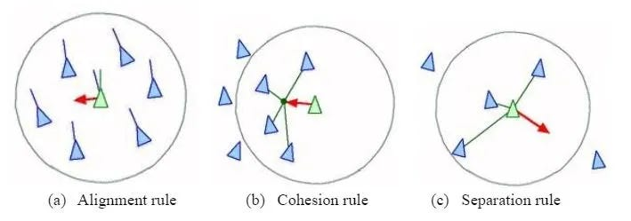
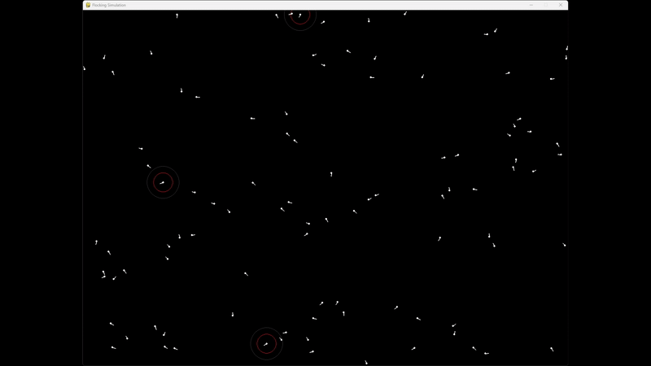

# Reinforcement Learning for Predator Behavior in a Flocking Environment

## Introduction

Flocking behavior is a well-studied phenomenon in artificial life simulations, commonly used to model collective movement in animals, drones, and robotic systems. This project explores the introduction of a predator into a classical flocking algorithm, where preys follow predefined behavioral rules, while the predator learns to hunt using Reinforcement Learning (RL).

## Classical Flocking Algorithm

The flocking behavior of preys follows three fundamental rules:

a. **Alignment**: Each prey aligns its velocity with nearby preys to maintain cohesive movement.

b. **Cohesion**: Each prey moves toward the average position of its neighbors to stay within the flock.

c. **Separation**: Each prey maintains a certain distance from nearby preys to avoid collisions.



This results in an emergent, natural-looking swarm behavior.



## Custom Environment: Introducing a Predator

To create a more dynamic environment, a predator was introduced into the system. The key modifications include:

- **Predator Movement**: Unlike preys, the predator does not follow flocking rules. Instead, its movement is determined by either predefined behavior or RL-based decision-making.
- **Prey Escape Mechanism**: Preys now attempt to flee from the predator using an additional "escape" behavior with a stronger coefficient than their normal separation rule.
- **Predator-Prey Interaction**: The predator attempts to catch preys, and preys are removed upon capture.


## Single-Predator Subproblem (branch: one_predator)

Before tackling the multi-predator scenario, a simpler environment with a single predator was chosen for initial RL experimentation. This allows for a clearer evaluation of RL algorithm performance without additional complexities introduced by predator cooperation or competition.

### Single predator Input and Output Model
The RL agent (predator) requires a well-defined observation space and action space:

- **Observation Space**:
  - Relative velocity of visible preys.
  - Relative position of visible preys.
  - Indicator values to differentiate between preys and predators. (always `1`)
  - Life state of the observed entity (1 if alive, 0 if dead).

  The observation format is structured as:

`
[Prey1 vx, Prey1 vy, Prey1 rp, Prey1 indicator, Prey1 isAlive,...]
`

    The fourth value (`1` or `0`) differentiates between preys (`1`) and predators (`0`).

    The fifth value (`1` or `0`) represents the life state, where `1` means alive and `0` means dead.

- **Action Space**:
    - Discrete steering actions: `[-2, -1, 0, 1, 2]`
    - These correspond to turning angles in increments of `30°`, ranging from `-60°` to `+60°`.


### Choosing a Reinforcement Learning Algorithm (To Be Developed)

This section will document the choice of RL algorithm (e.g., Q-Learning, Deep Q-Networks, or Policy Gradient methods) and the rationale behind it.

## Multi-Predator Scenario (To Be Developed)

This section will explore how to extend the RL model to multiple predators, incorporating cooperative or competitive strategies.

### multiple predator Input and Output Model
draft
```
The RL agent (predator) requires a well-defined observation space and action space:

- **Observation Space**:
  - Relative velocity of visible preys.
  - Relative position of visible preys.
  - Indicator values to differentiate between preys and predators.
  - Life state of the observed entity (1 if alive, 0 if dead).

  The observation format is structured as:

`
[Prey1 vx, Prey1 vy, Prey1 rp, Prey1 indicator, Prey1 isAlive,...]
`

    The fourth value (`1` or `0`) differentiates between preys (`1`) and predators (`0`).

    The fifth value (`1` or `0`) represents the life state, where `1` means alive and `0` means dead.

- **Action Space**:
    - Discrete steering actions: `[-2, -1, 0, 1, 2]`
    - These correspond to turning angles in increments of `30°`, ranging from `-60°` to `+60°`.`

```
## Conclusion

This project aims to develop an RL-controlled predator capable of hunting preys in a flocking environment. By starting with a single-predator model and gradually expanding to multiple predators, we can systematically analyze different RL strategies and evaluate their effectiveness in a dynamic, continuous-state environment.